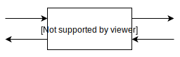
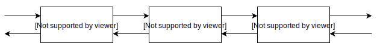
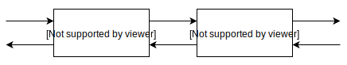
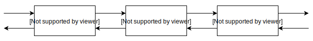

# Rate Limiter

Rate limiter (rps) implementation based on last second bucketing and sliding window.

## Algorithm

It's better visualize last second split into equals number of fixed size intervals, which timestamps
are truncated according to the rule: current_timestamp in milliseconds divided by width of interval
in milliseconds. Every new bucket added to a tail of a queue, where each element holds a truncated
timestamp and a count of requests per bucket. 

Assume we use 100ms width interval with 5 rps and no requests yet. 
New request comes at 1592171101900. We create a bucket with timestamp 1592171101900/100 = 15921711019 
and a request count = 1. Since our queue is empty add bucket to a tail:



We also store number of requests seen so far, which is 1

__total = 1__

Next request comes in at 1592171101950. We do next actions:

1) Remove all outdated buckets. Remove all buckets from a head of the queue where ts <= (1592171101950 - 1000) / 100 
and decrease __total__ by a number of requests in the bucket.

2) Compare __total__ with expected __rps__. If it's greater or equal than rps we cannot process the request, 
return _False_. Otherwise compare new bucket timestamp to a tail:

* if they are equal, increase number of requests in the tail bucket by 1
* if not equals, create a new bucket with new timestamp and requests = 1, and add to the tail
* increase __total__ by 1
* return __True_

Following this rule let's take a look further:

Next request comes at 1592171101950. 
* There are no outdated buckets. __total__ < __rps__
* 1592171101950 falls in the same bucket as the tail one (1592171101950 / 100 = 15921711019)
* We increase number of request in the tail bucket by 1


__total = 2__

for requests came at 1592171102013, 1592171102810 and 1592171102850 the queue will look like this



__total = 5__

Let's what happens for a request at 1592171102890:

* we still have no outdated buckets, so skip this step
* __total = 5__ is equal to __rps = 5__, so we return _False_ for this request. We exceeded 5 rps.
* queue remains unchanged

Next request comes at 1592171102980:

* bucket with ts = 15921711019 is outdated based on step 1, so we remove it from the head and decrease total by 2:



__total = 3__

* since __total = 3__ is less than __rps = 5__ and 1592171102980 / 100 = 15921711029 is a new bucket we add this to
the queue and return _True_:



__total = 4__

and so on ...

## Analysis

In a brute-force solutions the may store incoming requests in descending order, but that would require to traverse back
all requests happened in a last second that gives a time and space complexity of O(n). Using bucketing with sliding 
window approach requires effective constant space and time complexity, because number of buckets and traverses 
do not exceed a constant 1000 / interval width (in our case it's 10). 

However our approach may produce false positive results at certain rate. 
Consider a very simple example with 1 rps and 100ms bucket width.


There two requests came at 1592171101990 and 1592171102930 respectively. In spite on the interval between them
is less than 1 sec, second request will be processed anyway, because the first bucket will be considered as
outdated. Assuming uniform distribution of requests we will have 1000 / (interval width) * 0.5 percent false positive
outcomes. For 100ms interval it's about 5%. We can decrease this number by squashing the interval width. So, for 10ms
the error will be around 0.5% and for 1ms is 0.05% and so on. To be a 100% precise, each bucket may store references
to all requests timestamps within the bucket, so when we perform a last bucket out of date operation we go through all
requests within the bucket and compute actual total within a last second.

## Scalability

If we want to reach million users scalability, we may place a queue for each user on sharded HA cluster, for example,
Redis. Redis supports lists structure with atomic operations, that can be used for the same purpose. And requests are
distributed between shards based on user id.

For a global rate limiter queue could be placed on Redis replicas, where each replica has it's own rps which defined as
global rps divided by number of replicas. Requests are routed in Round-robin fashion.

## Testing

```shell script
 pytest -q tests/tests.py
```